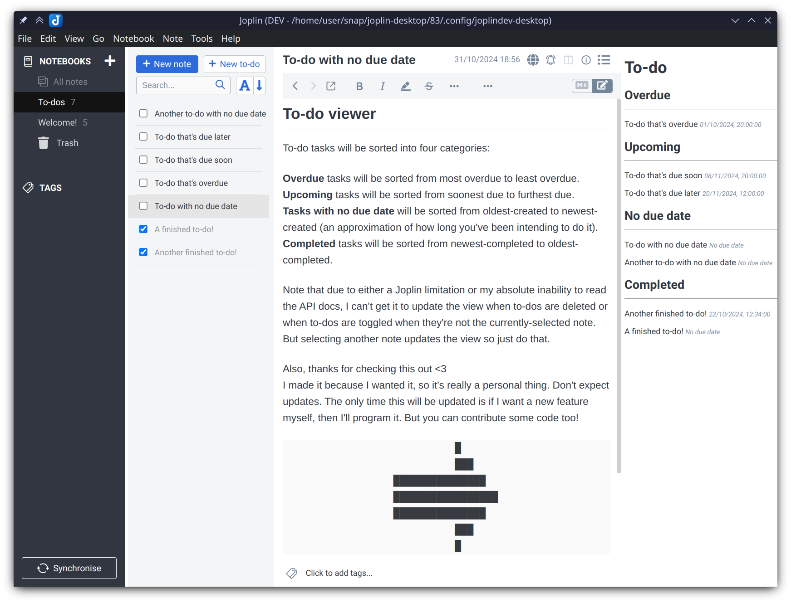

# To-do View

This plugin adds a panel which displays your to-do notes in one place, with no regular notes cluttering it up. It also neatly sorts them into categories.

To-dos are sorted into four categories:

* **Overdue** to-dos which are sorted from most overdue to least overdue.  
* **Upcoming** to-dos which are sorted from soonest due to furthest due.  
* **To-dos with no due date** which are sorted from oldest-created to newest-created (an approximation of how long you've been intending to do it).  
* **Completed** to-dos which are sorted from newest-completed to oldest-completed.

You can toggle the panel with Ctrl+Shift+T, by pressing the list icon in the toolbar, or via Tools > To-do > Toggle to-do view.

Note that due to either a Joplin limitation or my absolute inability to read the API docs, I can't get it to update the view when to-dos are deleted or when to-dos are toggled when they're not the currently-selected note. But selecting another note updates the view so just do that.

Also, thanks for checking this out <3  
I made it because I wanted it, so it's really a personal thing. Don't expect updates. The only time this will be updated is if I want a new feature myself, then I'll program it. But you can contribute some code too if you like!
